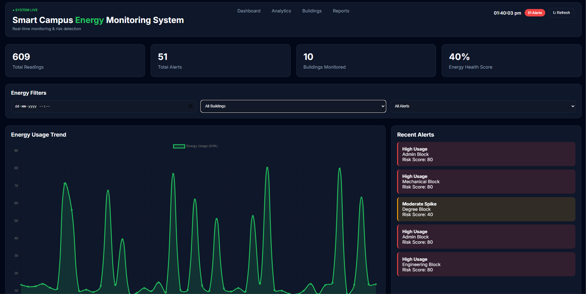

<h1 align="center">
⚡ Smart Campus Energy Monitoring System
</h1>

<p align="center">
Real-Time Energy Monitoring • Intelligent Anomaly Detection • Interactive Dashboard
</p>

<p align="center">


</p>

---

# 📌 Overview

The **Smart Campus Energy Monitoring System** is a web-based application developed to monitor, analyze, and visualize electricity consumption across multiple campus buildings in real time.

The system continuously collects energy readings, detects abnormal power consumption using threshold-based anomaly detection, stores historical data in PostgreSQL, and presents actionable insights through a modern interactive dashboard.

The primary objective of this project is to promote efficient energy management by providing administrators with live monitoring, analytical reports, and instant alerts whenever unusual energy usage is detected.

---

# 🚀 Key Features

- ⚡ Live Energy Monitoring
- 📊 Interactive Dashboard
- 📈 Real-Time Energy Trend Graphs
- 🏢 Building-wise Energy Consumption
- 🚨 Automatic Anomaly Detection
- 🔔 Recent Alert Notifications
- 📉 Energy Health Score
- 🔄 Auto Refresh Dashboard
- 🗄 Historical Data Storage
- 📋 Smart Reporting Interface

---

# 🏗 System Architecture

```
                Generator

                    │

                    ▼

          FastAPI Backend API

                    │

        ┌───────────┴───────────┐

        ▼                       ▼

 PostgreSQL Database      Detection Engine

        │                       │

        └───────────┬───────────┘

                    ▼

          Interactive Dashboard

          (HTML • CSS • JS)

                    │

                    ▼

            Charts • Alerts

          Building Monitoring
```

---

# 💻 Technology Stack

| Category | Technologies |
|----------|--------------|
| Backend | FastAPI, Python |
| Frontend | HTML5, CSS3, JavaScript |
| Database | PostgreSQL |
| Visualization | Chart.js |
| IDE | Visual Studio Code |
| Version Control | Git, GitHub |

---

# 📂 Project Structure

```
Smart-Campus-Energy-Monitoring-System
│
├── templates/
│     └── index.html
│
├── screenshots/
│     ├── Dashboard.png
│     ├── Energy building.png
│     ├── Energy chart.png
│     └── Recent alerts.png
│
├── database.py
├── detection.py
├── generator.py
├── main.py
├── requirements.txt
└── README.md
```

---

# 🖥 Dashboard Preview

<p align="center">



</p>

---

# 📸 Application Screens

## Dashboard


Displays system status, energy statistics, KPI cards, and live monitoring information.

---

## Energy Trend


Visual representation of energy consumption over time.

---

## Building Monitoring


Displays power consumption across different campus buildings.

---

## Recent Alerts


Shows automatically detected abnormal energy usage events.

---

# ⚙ Installation

## Clone Repository

```bash
git clone https://github.com/tirupathiraog/Smart_Campus-Energy-Monitoring-System.git
```

---

## Navigate

```bash
cd Smart_Campus-Energy-Monitoring-System
```

---

## Create Virtual Environment

```bash
python -m venv venv
```

---

## Activate

Windows

```bash
venv\Scripts\activate
```

Linux

```bash
source venv/bin/activate
```

---

## Install Packages

```bash
pip install -r requirements.txt
```

---

## Run Server

```bash
uvicorn main:app --reload
```

Open

```
http://127.0.0.1:8000
```

---

# 🔗 API Endpoints

| Endpoint | Method | Description |
|-----------|--------|-------------|
| / | GET | Dashboard |
| /upload | POST | Upload energy reading |
| /summary | GET | Dashboard summary |
| /energy/history | GET | Energy trend data |
| /alerts | GET | Recent alerts |
| /block/summary | GET | Building energy statistics |

---

# 🔄 System Workflow

```
Energy Generator

        │

        ▼

FastAPI Receives Data

        │

        ▼

PostgreSQL Storage

        │

        ▼

Detection Engine

        │

        ▼

Generate Alerts

        │

        ▼

Dashboard Updates

        │

        ▼

Administrator Monitoring
```

---

# 🎯 Project Objectives

- Monitor campus electricity usage in real time.
- Detect abnormal power consumption automatically.
- Improve energy management using visualization.
- Support decision-making with analytical insights.
- Reduce unnecessary energy wastage.

---

# 🔮 Future Scope

- Artificial Intelligence-based prediction
- Machine Learning anomaly detection
- SMS & Email Notifications
- Mobile Application
- Role-Based Authentication
- Cloud Deployment (AWS/Azure)
- IoT Smart Meter Integration
- Energy Forecasting

---

---

# 👨‍💻 Author

<table>
<tr>
<td>

### Tirupathi Rao

**Master of Computer Applications (MCA)**
**Dr. Lankapalli Bullayya College**
**Visakhapatnam, Andhra Pradesh**

Passionate about developing scalable web applications, cloud technologies, and data-driven solutions. This project demonstrates practical implementation of real-time energy monitoring, anomaly detection, interactive dashboards, and modern backend development using FastAPI and PostgreSQL.

📧 **Email:** tirulesnar.com

🔗 **GitHub:** https://github.com/tirupathiraog

🔗 **LinkedIn:** www.linkedin.com/in/tirupathiraog

</td>
</tr>
</table>

---

# 📄 License

This project is released for **educational and academic purposes**.

You are welcome to explore, study, and reference the source code for learning and non-commercial use. If you build upon this project, appropriate attribution is appreciated.

---

## 🤝 Contributing

Contributions, suggestions, and feature improvements are always welcome.

If you would like to contribute:

- Fork this repository
- Create a new feature branch
- Commit your changes
- Submit a Pull Request

---

## 🌟 Support

If you found this project helpful, please consider giving it a ⭐ on GitHub.

Your support helps increase the visibility of the project and encourages further development.

---

<p align="center">

**Thank you for visiting this repository!**

Made with ❤️ using **Python**, **FastAPI**, **PostgreSQL**, and **Chart.js**

</p>
